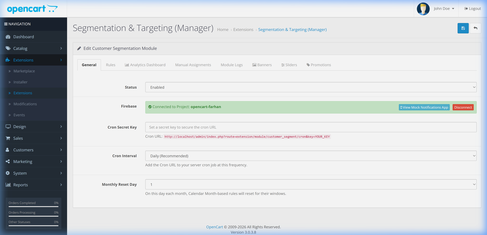
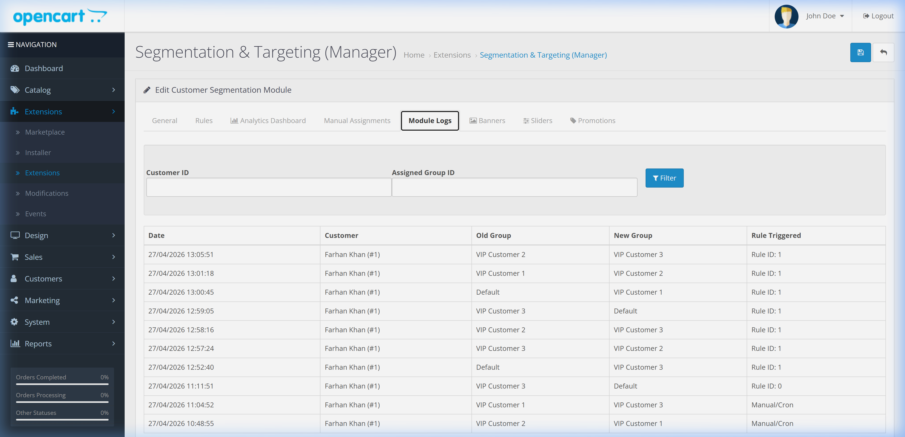
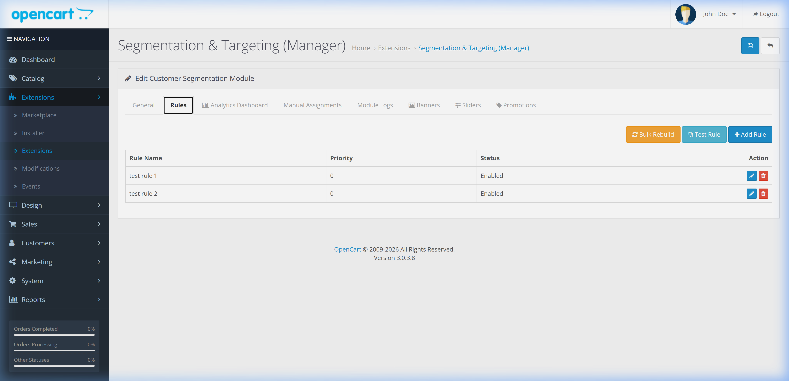
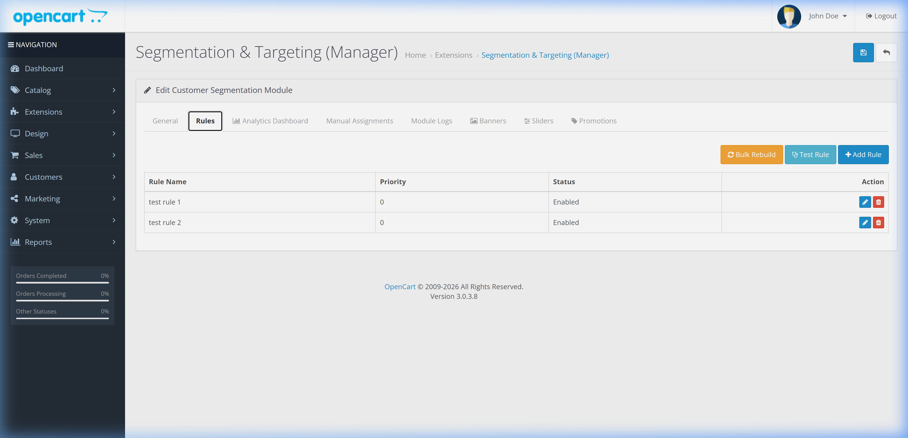
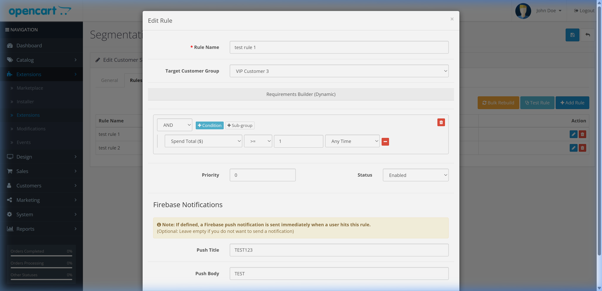
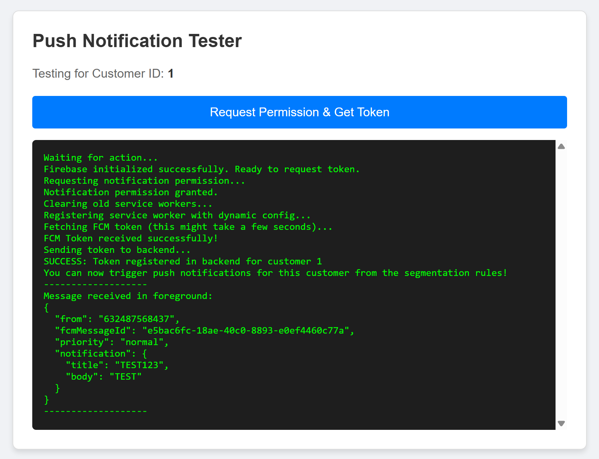
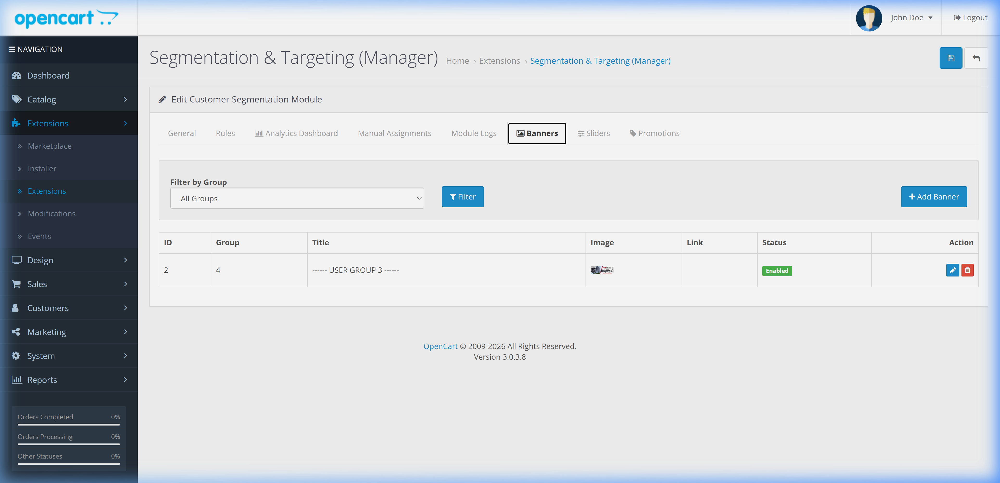
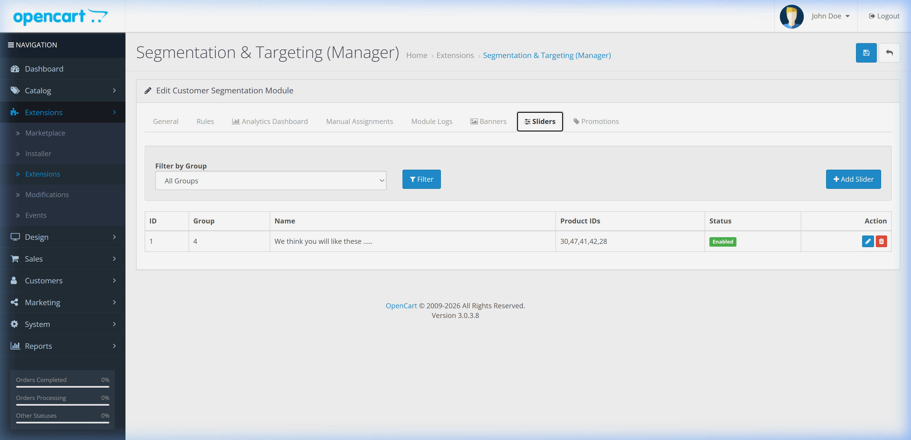
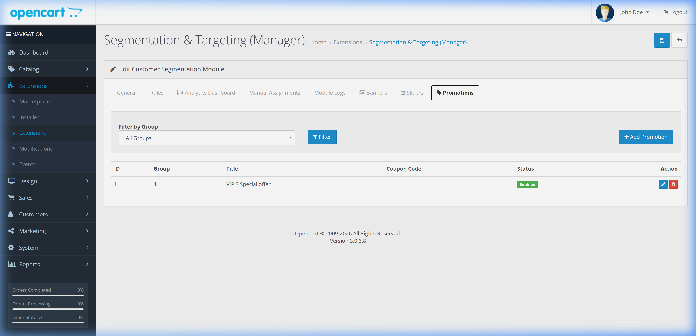

# Customer Segmentation & Targeting Guide

A comprehensive guide to the Customer Segmentation module for OpenCart 3.0.3.8. This module enables advanced customer group management, personalized frontend experiences, and automated push notifications through Firebase integration.

## Table of Contents
- [Customer Segmentation & Targeting Guide](#customer-segmentation--targeting-guide)
  - [Table of Contents](#table-of-contents)
  - [Quick Start: Docker Setup](#quick-start-docker-setup)
    - [Prerequisite](#prerequisite)
    - [Running the Project](#running-the-project)
  - [Overview](#overview)
    - [Customer Group Base](#customer-group-base)
    - [Key Features](#key-features)
    - [Relevant Links](#relevant-links)
  - [Administrative Configuration](#administrative-configuration)
    - [General Settings](#general-settings)
    - [Connectivity & Logs](#connectivity--logs)
  - [Rule Engine](#rule-engine)
    - [Managing Rules](#managing-rules)
    - [Bulk Rebuild Feature](#bulk-rebuild-feature)
    - [Rule Configuration](#rule-configuration)
  - [Firebase Integration & Push Notifications](#firebase-integration--push-notifications)
    - [Setup Process](#setup-process)
    - [Mock Notifications App (Testing)](#mock-notifications-app-testing)
  - [Personalized Frontend Widgets](#personalized-frontend-widgets)
    - [Component Types](#component-types)
    - [Configuration](#configuration)
  - [Frontend & Mobile APIs](#frontend--mobile-apis)
    - [Catalog APIs (Customer-Facing)](#catalog-apis-customer-facing)
      - [1. Get Personalized Content](#1-get-personalized-content)
      - [2. Save FCM Token](#2-save-fcm-token)
      - [3. Trigger Calculation (Cron)](#3-trigger-calculation-cron)
    - [Administrative APIs (Management)](#administrative-apis-management)
      - [Rule Management](#rule-management)
      - [Segment & content Management](#segment--content-management)
      - [Analytics & Utilities](#analytics--utilities)
  - [Developer Information](#developer-information)
    - [Database Schema](#database-schema)
    - [Event Hooks](#event-hooks)
    - [Server Deployment (VPS)](#server-deployment-vps)

---

## Quick Start: Installation Options

Depending on your needs, you can either run the full pre-configured sample project or install the plugin standalone on an existing OpenCart site.

### Option A: Full Sample Project (Recommended for Testing)
Use the **`opencart_customer_segmentation_sample.zip`** package. This contains a complete, containerized OpenCart environment.

1. **Extract** the ZIP file onto your machine.
2. **Launch**: Open your terminal in the project directory and run:
   ```bash
   docker-compose up --build
   ```
3. **Access**:
   - **Store Frontend**: `http://localhost/`
   - **Admin Panel**: `http://localhost/admin/` (Login: `opencart` / `opencart`)
   - **Database (phpMyAdmin)**: `http://localhost:8080/`

---

### Option B: Standalone Plugin Installation
Use the **`customer_segmentation.ocmod.zip`** package if you already have an existing OpenCart 3.0.3.8 site.

1. **Extract** the plugin ZIP locally.
2. **Upload**: Copy the contents of the `upload/` folder to your OpenCart root directory (preserving the directory structure).
3. **Installer Option**: Alternatively, go to **Extensions -> Installer** and upload the `customer_segmentation.ocmod.zip` file directly.
4. **Install**:
   - Go to **Extensions -> Extensions -> Modules**.
   - Find **Segmentation & Targeting (Manager)** and click **Install**.
   - Click **Edit** to configure settings and rebuild the database schema (automatic on first run).
5. **Events**: The module automatically registers the necessary event hooks upon installation.

---

## Overview

The Customer Segmentation module is a powerful tool designed to help store owners deliver targeted content and automated marketing actions based on customer behavior and attributes.

### Customer Group Base
> [!IMPORTANT]
> The segmentation feature is built directly on top of OpenCart's internal **Customer Groups**. All rules eventually result in moving a customer between these groups, which then controls the visibility of personalized banners, sliders, and promotions.

### Key Features
- **Dynamic Segmentation**: Automatically reassign customers to different groups based on custom rules (e.g., total spend, order frequency).
- **Personalized UI**: Display specific banners, product sliders, and promotional boxes to different customer segments.
- **Push Notifications**: Integrated Firebase support for sending automated push notifications when customers enter new segments.
- **Seamless Management**: Integrated logs and a "Mock Notifications App" for easy testing.

### Relevant Links
- [Firebase Console](https://console.firebase.google.com/)
- [OpenCart User Manual](http://docs.opencart.com/)
- [Firebase Cloud Messaging Documentation](https://firebase.google.com/docs/cloud-messaging)

---

## Administrative Configuration

The module's main management interface is located under **Extensions -> Extensions -> Modules -> Segmentation & Targeting (Manager)**.

### General Settings
In the **General** tab, you can enable or disable the module and configure the core Firebase connection.



### Connectivity & Logs
- **Firebase Connection**: Upload your Firebase Service Account JSON to establish a secure connection.
- **Module Logs**: Monitor all segmentation activities, group reassignments, and notification triggers in the **Logs** tab.



---

## Rule Engine

The heart of the module is the Rule Engine, which allows you to define how and when customers are segmented.

### Managing Rules
Rules are listed in the **Rules** tab. You can set priorities to determine which rule takes precedence if multiple rules match a customer.



### Bulk Rebuild Feature
The **Bulk Rebuild** button allows you to re-evaluate all existing customers against all active rules simultaneously. This is essential after creating new rules or modifying existing ones to ensure the entire database is correctly segmented.



### Rule Configuration
Each rule consists of **Triggers**, **Conditions**, and **Actions**.



- **Triggers**: Define the event that starts the evaluation (e.g., "After Checkout", "Daily Cron").
- **Conditions**: Use the "Requirements Builder" to set specific criteria (e.g., "Total Orders > 5", "Registered within last 30 days").
- **Actions**: Define what happens when a match is found (e.g., "Reassign Group", "Send Notification").

---

## Firebase Integration & Push Notifications

The module uses Firebase Cloud Messaging (FCM) for real-time engagement.

### Setup Process
1. Create a project in the [Firebase Console](https://console.firebase.google.com/).
2. Generate a **Service Account JSON** file and upload it in the module's General settings.
3. Configure your **VAPID Key** for web push notifications.

### Mock Notifications App (Testing)
To test your setup without a live frontend app, use the integrated **Mock Notifications App**.

1. Navigate to the rule you want to test.
2. Open the testing modal and click "Open Mock App".
3. Request notification permission to register a test token.
4. Trigger the rule action to see the notification arrive instantly.



---

## Personalized Frontend Widgets

Deliver the right message to the right person using specialized layout modules.

### Component Types
1. **Banners**: Display targeted promotions or welcome messages.
2. **Product Sliders**: Show recommended products based on the customer's segment.
3. **Promotions**: Special offers with descriptions and optional coupon highlights.

### Configuration
Manage targeted content within the Manager module, then assign the corresponding layout modules in **Design -> Layouts**.





---

## Frontend & Mobile APIs

The module provides specialized JSON endpoints categorized into customer-facing (Catalog) and management-facing (Administrative) APIs.

### Catalog APIs (Customer-Facing)
These endpoints are used by the storefront or mobile app. They require a valid customer session.

#### 1. Get Personalized Content
Returns segments-specific content for the logged-in customer.
- **URL**: `index.php?route=extension/module/customer_segment/getPersonalized`
- **Method**: `GET`
- **Response**: JSON object containing `banners`, `sliders`, and `promotions`.

#### 2. Save FCM Token
Registers a Firebase token for push notifications.
- **URL**: `index.php?route=extension/module/customer_segment/saveToken`
- **Method**: `POST` (Param: `token`)

#### 3. Trigger Calculation (Cron)
Securely triggers the rule evaluation engine.
- **URL**: `index.php?route=extension/module/customer_segment/cron&key=YOUR_KEY`
- **Method**: `GET`

### Administrative APIs (Management)
These endpoints are used for building custom administrative dashboards or integrations. They require a valid `user_token` (Admin Session).

#### Rule Management
- **List Rules**: `GET admin/index.php?route=extension/module/customer_segment/getRules&user_token=...`
- **Get Rule Details**: `GET admin/index.php?route=extension/module/customer_segment/getRule&rule_id=X&user_token=...`
- **Save Rule**: `POST admin/index.php?route=extension/module/customer_segment/saveRule&user_token=...`
- **Delete Rule**: `GET admin/index.php?route=extension/module/customer_segment/deleteRule&rule_id=X&user_token=...`
- **Test Rule**: `POST admin/index.php?route=extension/module/customer_segment/testRule&user_token=...` (Params: `rule_id`, `customer_id`)

#### Segment & content Management
- **Manual Assignments**: `GET .../getManuals`, `POST .../addManual`, `GET .../deleteManual`
- **Banners**: `GET .../getBanners`, `POST .../saveBanner`, `GET .../deleteBanner` (Supports filtering by `customer_group_id`)
- **Sliders**: `GET .../getSliders`, `POST .../saveSlider`, `GET .../deleteSlider`
- **Promotions**: `GET .../getPromotions`, `POST .../savePromotion`, `GET .../deletePromotion`

#### Analytics & Utilities
- **Activity Logs**: `GET .../getDynamicLogs` (Supports pagination and filtering)
- **Bulk Rebuild**: `GET .../bulkRebuild&start=0` (Processes in batches of 50)
- **Firebase Connectivity**: `POST .../verifyFirebase`, `POST .../disconnectFirebase`
- **Helpers**: `GET .../autocomplete` (Customer search), `GET .../getProductInfo` (Multi-product details)

---

## Developer Information

### Database Schema
The module introduces several new tables to support its functionality:

| Table Name                   | Description                                          |
| ---------------------------- | ---------------------------------------------------- |
| `customer_segment_rule`      | Stores rule definitions, priorities, and conditions. |
| `customer_segment_fcm_token` | Stores device tokens for push notifications.         |
| `customer_segment_log`       | Audit trail for group changes and rule triggers.     |
| `customer_segment_manual`    | Stores manual segment overrides and locks.           |
| `customer_segment_banner`    | Stores targeted banner content linked to groups.     |
| `customer_segment_slider`    | Stores targeted product slider configurations.       |
| `customer_segment_promotion` | Stores targeted promotional messages and codes.      |

Additionally, the core `customer` table is extended with:
- `date_of_birth`: Supports age-based segmentation.
- `gender`: Supports demographic targeting.

### Event Hooks
The module utilizes OpenCart's event system to trigger real-time evaluations:
- `catalog/model/checkout/order/addOrderHistory/after`: Evaluates rules after a successful checkout.

### Server Deployment (VPS)
For a complete walkthrough on deploying this project to a fresh Contabo VPS using Docker, see the dedicated **[SERVER_DEPLOYMENT.md](guide/SERVER_DEPLOYMENT.md)** file.

It includes:
- Command to install Docker/Compose on Ubuntu.
- `scp` command for file transfer.
- Automated launch commands.
